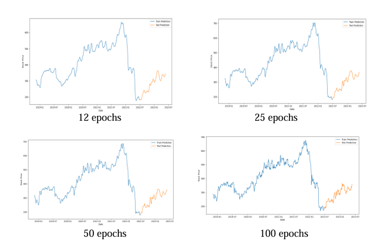
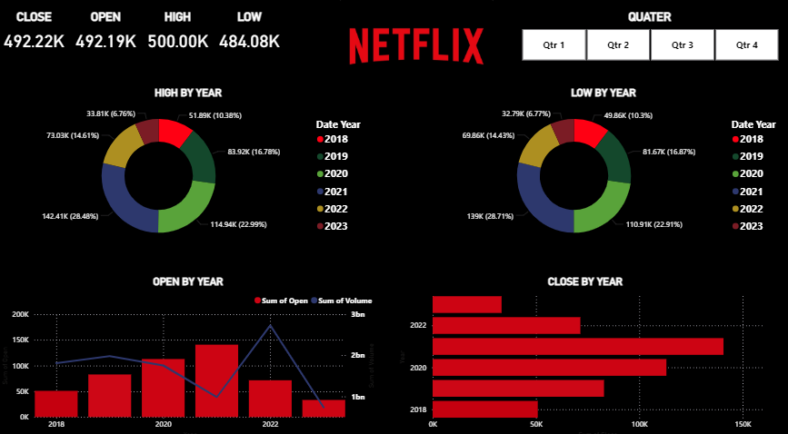

# 📈 Netflix Stock Price Analysis and Prediction

This project involves building a predictive model using **Recurrent Neural Networks (RNN)** to forecast Netflix stock prices based on historical market data. The aim is to analyze stock trends using technical indicators and train a deep learning model for accurate future price predictions.

---

## 🚀 Project Highlights

- 🧠 Developed a **Recurrent Neural Network (RNN)** model for time-series prediction.
- 📊 Incorporated key **technical indicators** including:
  - **EMA** (Exponential Moving Average)
  - **SMA** (Simple Moving Average)
  - **RSI** (Relative Strength Index)
  - **Bollinger Bands**
- ⚙️ Conducted training over **multiple epochs (12, 25, 50, and 100)** to evaluate model performance and stability.
- 🧼 Preprocessed and cleaned the data using **Pandas** and **NumPy** for effective feature extraction.

---

## 🛠️ Tech Stack

- **Programming Language**: Python
- **Libraries**:
  - `NumPy`, `Pandas` – Data preprocessing
  - `Matplotlib`, `Seaborn` – Data visualization
  - `TensorFlow` / `Keras` – Model building and training
  - `scikit-learn` – Metrics and scaling

---

## 📈 Technical Indicators Used

| Indicator       | Description |
|----------------|-------------|
| EMA            | Gives more weight to recent prices for smoother trend analysis. |
| SMA            | Simple average of closing prices over a specific time window. |
| RSI            | Measures recent price changes to evaluate overbought/oversold conditions. |
| Bollinger Bands| Defines high/low on a relative basis using standard deviation around SMA. |

---

## 🧪 Model Architecture

- **Input Layer**: Scaled sequences of stock data (with technical indicators)
- **Hidden Layers**: RNN or LSTM layers (can be customized)
- **Output Layer**: Next day’s stock price
- **Loss Function**: Mean Squared Error (MSE)
- **Optimizer**: Adam

---

## 📷 Screenshots


### 🔹 Training of the model on the different epochs



### 🔹 Analysis of verious trends



---

## 🧾 How to Run the Project

1. **Clone the repository**:
   ```bash
   git clone https://github.com/your-username/projects.git
   cd projects/netflix-stock-analysis

2. **Install the required libraries and dependencies**:
3. **Run the notebook or script**:
```bash
 jupyter notebook model.ipynb
