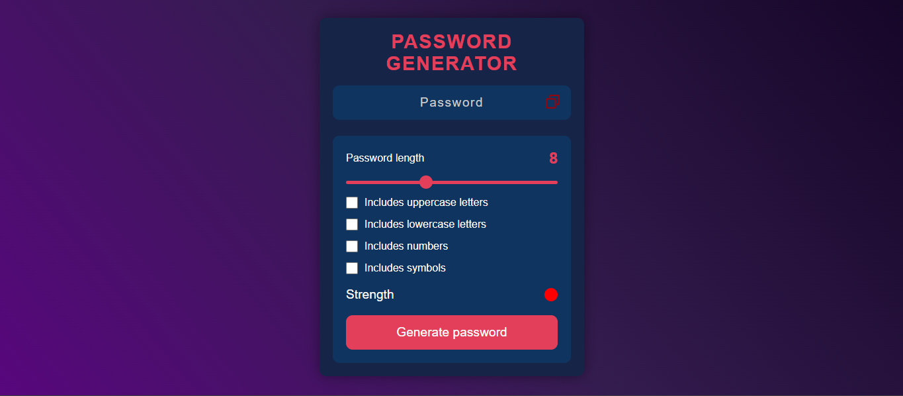

# 🔐 Password Generator Web App

A sleek and customizable password generator built using **HTML**, **CSS**, and **JavaScript**. This app allows users to generate strong and secure passwords based on user-defined parameters such as length, character types, and strength.

---

## 🚀 Features

- 🎯 Set password length using a slider
- 🔤 Include:
  - Uppercase letters
  - Lowercase letters
  - Numbers
  - Symbols
- 🟢 Real-time password strength indicator
- 📋 One-click copy to clipboard
- 💡 Clean, modern UI with responsive design

---

## 🖼️ Screenshots

> Place this image in your `assets/` folder and refer it correctly.

### 🔹 App UI



---

## 🛠️ Tech Stack

- **HTML5** – Structure
- **CSS3** – Styling (Dark Mode UI with gradient background)
- **JavaScript** – Logic for password generation and user interactions

---

## 📄 How to Use

1. **Clone the repository:**

```bash
git clone https://github.com/akshat11x/password-generator.git
cd password-generator
```
2.Open index.html in a browser:
```bash
start index.html
```
Choose your settings:

3. Set desired password length
-Select character types (uppercase, numbers, symbols, etc.)
-Click “Generate password”

4. Copy password to clipboard with one click

## 📌 Future Enhancements
-Add password history feature
-Show password strength score using entropy
-Export generated password list as .txt or .csv

## 🙌 Acknowledgments
Inspired by modern password managers and security best practices
